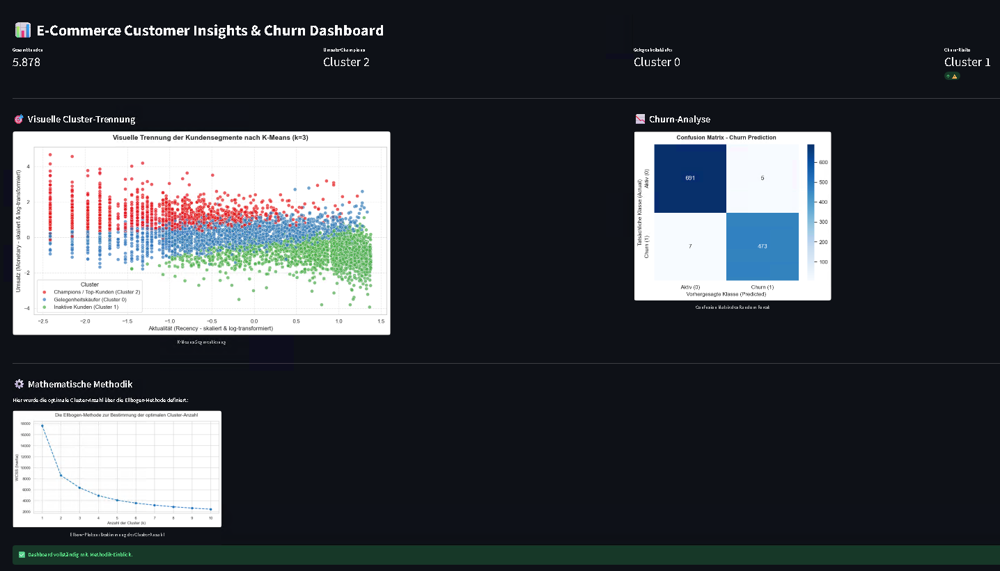

# E-Commerce Customer Intelligence & Churn Prediction System

[🇬🇧 English](#english) | [🇩🇪 Deutsch](#deutsch)

---

## Dashboard Preview

---

## 🇬🇧 English
This project leverages advanced data analytics and machine learning to optimize e-commerce performance. By utilizing the *Online Retail II* dataset, the system implements a two-fold analytical approach: **Customer Segmentation** to maximize Customer Lifetime Value (CLV) and **Churn Prediction** to proactively retain customers.

### Key Capabilities
- **RFM Analysis:** Segmentation of customers into high-value, casual, and at-risk groups using K-Means clustering.
- **Predictive Analytics:** Random Forest classification model to identify churn probability with 98.9% accuracy.
- **Interactive Dashboard:** A comprehensive Streamlit interface providing actionable business intelligence.

### Tech Stack
- **Languages:** Python
- **Libraries:** Pandas, Scikit-Learn, Seaborn, Streamlit

---

## 🇩🇪 Deutsch
Dieses Projekt nutzt Data Analytics und Machine Learning zur Optimierung der E-Commerce-Performance. Auf Basis des *Online Retail II*-Datensatzes verfolgt das System einen zweistufigen analytischen Ansatz: **Kundensegmentierung** zur Steigerung des Customer Lifetime Value (CLV) und **Churn-Prävention** zur proaktiven Kundenbindung.

### Kernfunktionen
- **RFM-Analyse:** Segmentierung der Kunden in profitable, Gelegenheits- und abwanderungsgefährdete Gruppen mittels K-Means-Clustering.
- **Predictive Analytics:** Random-Forest-Klassifikationsmodell zur Identifikation von Abwanderungswahrscheinlichkeiten mit 98,9% Genauigkeit.
- **Interaktives Dashboard:** Ein umfassendes Streamlit-Interface zur Bereitstellung handlungsorientierter Business-Insights.

### Technischer Stack
- **Sprache:** Python
- **Bibliotheken:** Pandas, Scikit-Learn, Seaborn, Streamlit

---

## Data Source
The dataset used for this project is the **Online Retail II** dataset, provided by the [UCI Machine Learning Repository](https://archive.ics.uci.edu/dataset/502/online+retail+ii).

---

## Project Workflow
1. **Data Engineering:** Consolidating multi-year transaction data (located in `/data`) and rigorous data cleansing.
2. **Feature Engineering:** Deriving RFM metrics to quantify customer behavior.
3. **Modeling:** Implementing scalable ML pipelines for segmentation and classification (see `/notebooks`).
4. **Deployment:** Providing a decision-support tool via an interactive dashboard (`app.py`).

*This system translates complex statistical models into clear, strategic recommendations for SEO and marketing optimization.*
